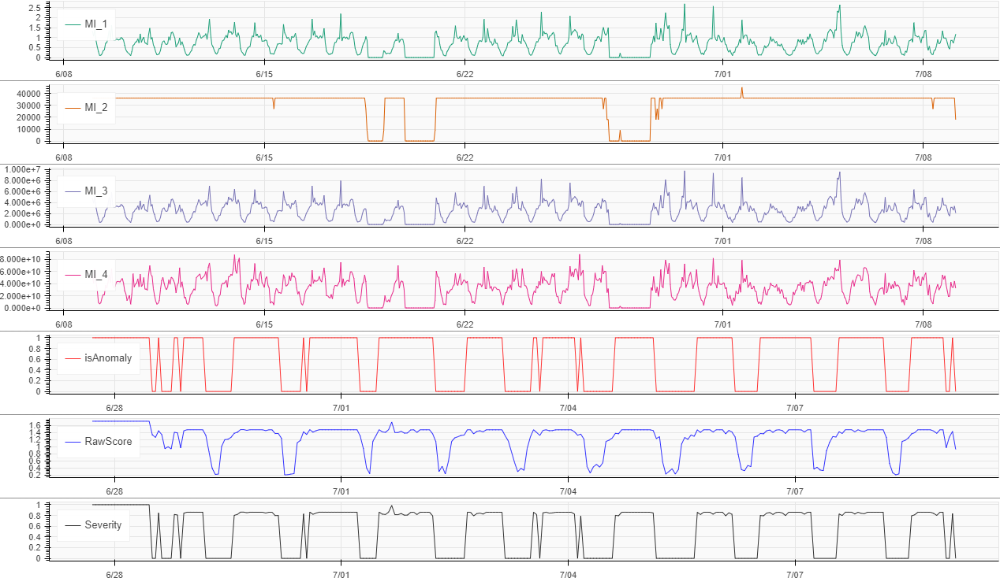
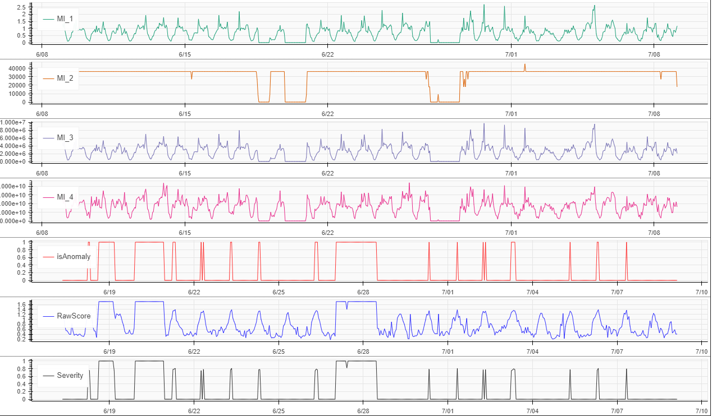
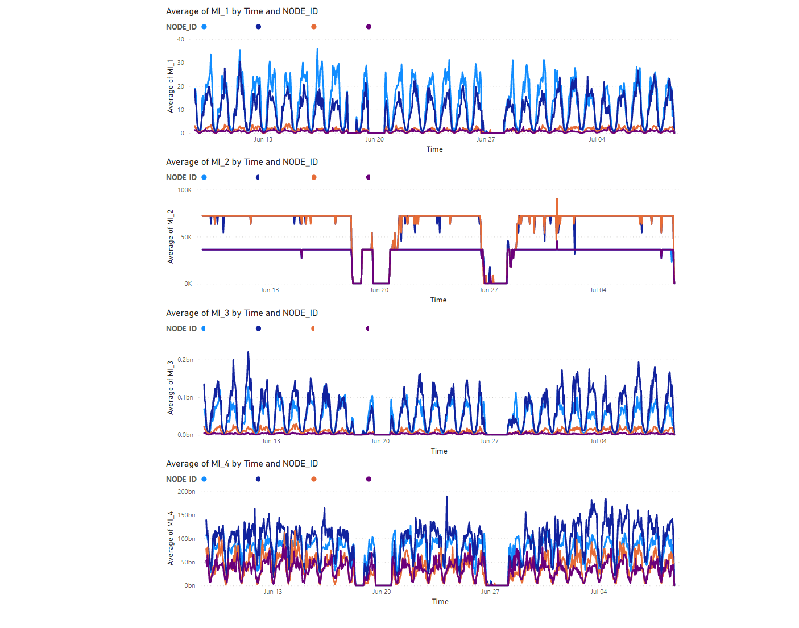

# Multivariate Anomaly Detection
Azure Multivariate Anomaly Detection service is used to detect anomaly across a set of network nodes. The dataset should be in the below format

        INDEX,NODE_ID,Time,MI_1,MI_2,MI_3,MI_4

Where MI_1, MI_2, MI_3, MI_4 are multi variate variable across which MVAD service is used to detect anomalies. 

## Prerequisites

This requires the below Azure services to be provisioned. 

[Anomaly Detector](https://azure.microsoft.com/en-us/pricing/details/cognitive-services/anomaly-detector/)

[Azure Blob Storage](https://azure.microsoft.com/en-us/pricing/details/storage/blobs/)

## Anomaly Detection using one network node as training data set
mvad-networknodes.ipynb notebook uses a given network node id as source data for training the MVAD model. This trained model is to inference anomaly in another network node. This can be used if there isn't too much variation in data value ranges across the network nodes. 

## Anomaly Detection using one network node as both training and inference data set
mvad-networknodes-same-dataset.ipynb notebook uses a given network node id as source data for training the MVAD service. This trained model is used to inference anomaly across the same node id used in the training but across a different sliding window. 

## Variation in data values across different node ids
